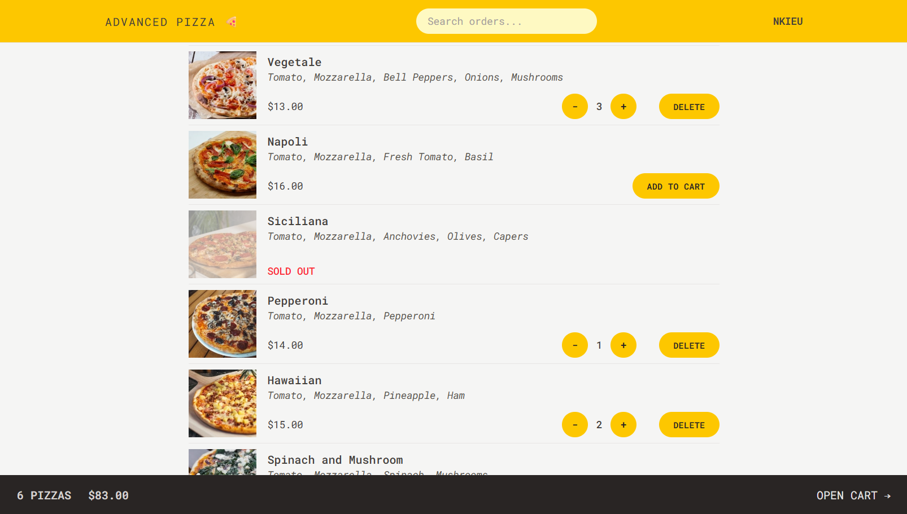
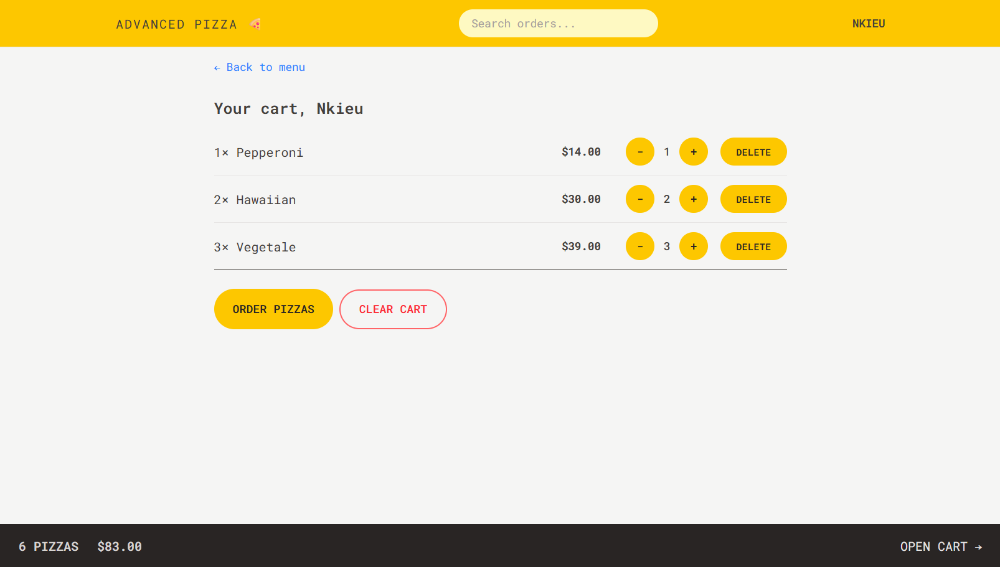
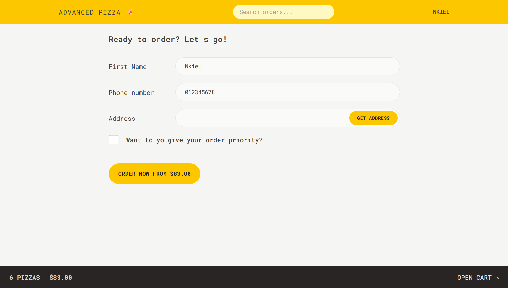
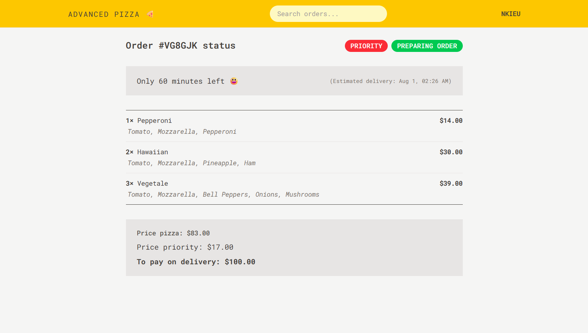

# 🍕 Advanced Pizza App

A modern pizza ordering application built with React, Redux Toolkit, and React Router. Users can browse the menu, customize their orders, set delivery priority, and track their order status.

---

## 🌐 Live Demo

👉 [Try the live Application](https://nkieu-advanced-pizza.vercel.app/)

---

## 📸 Screenshots

<table>
  <tr>
    <td></td>
    <td></td>
  </tr>
  <tr>
    <td></td>
    <td></td>
  </tr>
</table>

---

## ✨ Key Features

- 📖 **Dynamic Menu** – Fetches and displays the pizza menu from a REST API.
- 🛒 **Advanced Shopping Cart** – Add, remove, and update quantities of pizzas in the cart, all managed in a global Redux state.
- 📝 **Order Placement** – A user-friendly form to create new orders, complete with phone number validation.
- 📍 **Geolocation** – Automatically fetches the user's address with a single click using the browser's Geolocation API.
- 🔍 **Order Tracking** – Users can look up their order by ID to see its current status, estimated delivery time, and contents.
- ⚙️ **Modern Data Handling** – Uses **React Router's `loader` and `action` functions** for all data fetching and form submissions, providing a seamless UX with built-in loading states and error handling.
- 🔁 **Centralized State** – Global UI state for user information and the shopping cart is managed efficiently with **Redux Toolkit**.
- 📱 **Responsive UI** – Fully optimized interface that works smoothly across mobile, and desktop screens.

---

## 🧠 Learning Objectives

This application was built to master and demonstrate advanced concepts in modern React development:

### ✅ React Router

- Routing with `createBrowserRouter`.
- Data fetching with route **`loader`** functions.
- Data submission and mutation with route **`action`** functions.
- Declarative data fetching in components with the **`useFetcher`** hook.
- Programmatic navigation with the **`useNavigate`** hook.

### ✅ Redux Toolkit

- Store configuration using `configureStore`.
- State management with feature slices using **`createSlice`**.
- Handling asynchronous logic with **`createAsyncThunk`**.
- Using selector functions for optimized state reading, including memoized selectors that accept arguments.

### ✅ Professional Architecture

- Clean separation of concerns with a feature-folder structure.
- Reusable, composable UI components.
- Separating API logic into service files.

### ✅ Styling & Development Tools

- Building responsive UIs with **Tailwind CSS**.
- Setting up a modern development environment with **Vite**.
- Code formatting with Prettier and the Tailwind plugin.

---

## 🛠️ Technology Stack

| Technology           | Description                               |
| -------------------- | ----------------------------------------- |
| **JavaScript**       | Modern ES6+ syntax and features           |
| **React**            | JavaScript UI Library (v19)               |
| **Redux Toolkit**    | Modern Redux state management             |
| **React Router**     | Declarative routing and data loading (v7) |
| **Tailwind CSS**     | Utility-first CSS framework (v4)          |
| **Vite**             | Fast build tool and dev server            |
| **BigDataCloud API** | Reverse geocoding for geolocation         |

---

## 🚀 Installation & Setup

1. **Clone the repository**

```bash
git clone https://github.com/nkieu-config/advanced-pizza-app-project.git
```

2. **Install dependencies**

```bash
npm install
```

3. **Start the development server**

```bash
npm run dev
```

---

## 📚 Course Credit

This project was built as part of **[The Ultimate React Course 2025](https://www.udemy.com/course/the-ultimate-react-course/)** by [Jonas Schmedtmann](https://codingheroes.io/).

---

## 📃 License

This is a personal learning project. Not licensed for commercial use.
